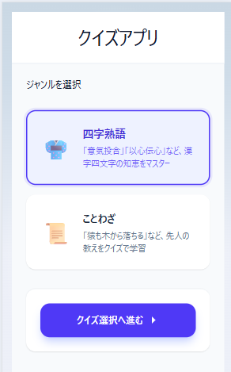
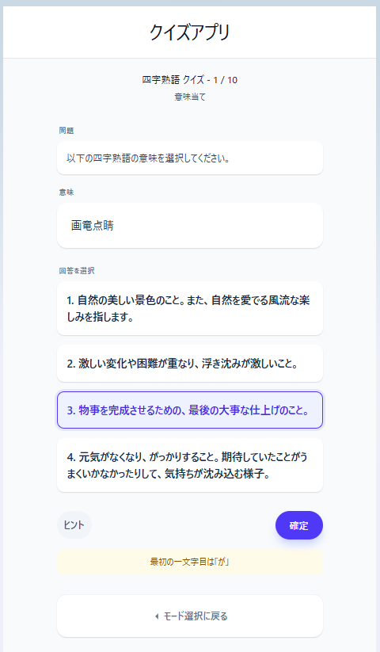

# 四字熟語・ことわざクイズシステム

このシステムは、日本の伝統的な言語表現である「四字熟語」と「ことわざ」をクイズ形式で学べるフルスタックWebアプリケーションです。
モダンなフロントエンドフレームワークと、高速なGo言語によるサーバーレスバックエンドを組み合わせたスケーラブルな構成を採用しています。

## 🚀 技術スタック

### フロントエンド

- **フレームワーク**: SvelteKit (Svelte 5)
- **言語**: TypeScript
- **スタイリング**: Tailwind CSS 4.0
- **ビルドツール**: Vite

### バックエンド

- **言語**: Go
- **実行環境**: Vercel Serverless Functions
- **データベース**: Turso (libSQL)

### インフラ / デプロイ

- **プラットフォーム**: Vercel (Frontend & Backend 同時ホスティング)
- **CI/CD**: GitHub Integrationによる自動デプロイ

## ✨ 主な機能

- **ジャンル別クイズ取得**: クエリパラメータにより「四字熟語」と「ことわざ」のデータを動的に切り替えて取得。
- **レスポンシブデザイン**: PC、モバイル双方で快適に利用可能なUI。
- **高速なデータアクセス**: エッジデータベース（Turso）を活用し、世界中どこからでも低レイテンシでデータを配信。

## 📸 画面イメージ

### 1. ジャンル選択（トップ画面）

「四字熟語」または「ことわざ」のいずれか学習したいカテゴリーを選択するエントリー画面です。直感的なインターフェースでスムーズに学習を開始できます。



### 2. クイズ回答・解説画面

選択したジャンルの問題がランダムに出題されます。回答後には即座に正誤判定が行われ、読み、意味、さらには具体的な「用法」までをセットで確認できるため、深い理解を助けます。



## � システム構成の工夫・アピールポイント

### 1. Svelte 5 (Runes) の採用

最新の Svelte 5 を採用し、`$state` や `$derived` といった Runes を活用することで、リアクティブなコードの簡潔さとパフォーマンスの両立を実現しています。

### 2. Goによるサーバーレスアーキテクチャ

バックエンドに Go 言語を採用し、Vercel のサーバーレス関数として動作させています。これにより、メモリフットプリントを最小限に抑えつつ、リクエストに対する高速な起動（Cold Startの抑制）と処理を実現しています。

### 3. モノレポ構成とインフラ定義の統合

`frontend` と `backend` を一つのリポジトリで管理するモノレポ構成を採用。`vercel.json` を用いて、フロントエンドの静的ビルドとバックエンドの Go コンパイル、およびルーティングを単一の設定ファイルで制御しています。

### 4. エッジ環境に最適化したデータベース

データベースには SQLite ベースの Turso (libSQL) を採用。サーバーレス関数からの接続に最適化されており、コネクションのオーバーヘッドを抑えた効率的なデータ取得を行っています。

### 5. CORSとセキュリティの考慮

環境変数による `ALLOWED_ORIGIN` の制御や、ブラウザからのプリフライトリクエスト（OPTIONSメソッド）への適切なハンドリングなど、実運用を想定したセキュリティ対策を実装しています。

## 📦 開発環境のセットアップ

### ローカル実行

Vercel CLIを使用して、本番環境に近い状態で実行できます。

```bash
# 環境変数の同期（Vercelと連携済みの場合）
vercel env pull .env.local

# 開発サーバーの起動
vercel dev
```

### ディレクトリ構造

- `/frontend`: SvelteKit プロジェクト
- `/backend`: Go API (Handler パッケージ)
- `vercel.json`: プロジェクト全体のデプロイ設定
